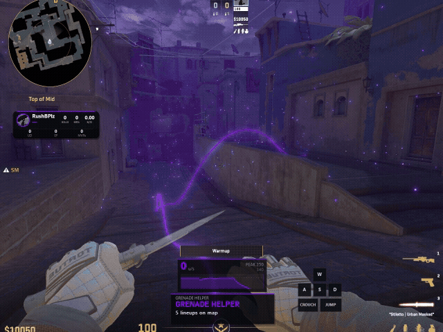

  
# DaizML

Aimware CS2 Lua. 

## Requirements

[Aimware](https://aimware.net/) for CS2
http & ffi enabled

## Install

Copy `DaizML.lua` into your Aimware folder (YourDrive\Users\YourWinUserName\AppData\Roaming\RandomStringsFolder1\RandomStringsFolder2) 

Load it from the Lua tab 

Toggle the menu with the bind (Del by default) in **Settings** (or follow Aimware's menu if you leave that option on) 

Optional assets (nade icons, particle catalog) are pulled from this repo when missing. Local files win if you already have them. 

## What's in it

**Skin changer**  
Paint, wear, seed, stickers, nametags, charms. Inspect-link decode for hex / CSFloat-style links (inventory `S…A…D…M…` links need Steam GC — not supported). Apply to CT or T from the popup.

**Grenade helper**  
Save throws per map, stand markers, aimspots, hold-to-execute replay. Automatic recording of grenade throws and an Edit mode for renaming / deleting / managing spots. Lineups store in `DaizML_lineups.txt`.

**Visuals**  
Step ESP, death effects, coach trail, viewmodel + FOV override.

**Misc**  
Watermark, velocity graph, player hud, radar overlay, WASD/key display, left-hand knife, sniper / deagle quickswitch.

**Particle tester**  
Browse / spawn particles from a catalog (downloads `DaizML_particle_catalog.txt` if needed).

**Settings**  
Menu key, appearance, config slots.

## Notes

First load mid-match is fine; skin loop should start without rejoining.
Grenade SVG icons look for `assets/` under the cheat or Lua folder, then fall back to GitHub.
Particle / sticker name lists can require HTTP. If Lua HTTP is blocked, those bits stay offline.

## Files 

| File | Purpose |
|------|---------|
| `DaizML.lua` | The script |
| `DaizML_lineups.txt` | Saved grenade throws |
| `DaizML_skins.txt` | Saved skins |
| `DaizML_particle_catalog.txt` | Particle list (auto-fetched) |
| Config slots | Saved with the cheat's config path |

## Disclaimer

Use at your own risk

## Credits

Built for personal use. Bits of inspiration from other Aimware Lua scripts. 

